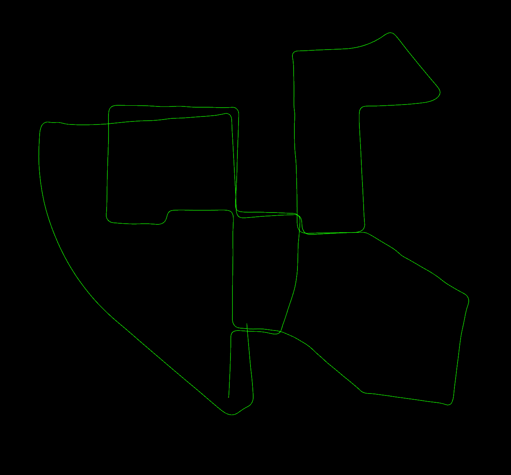
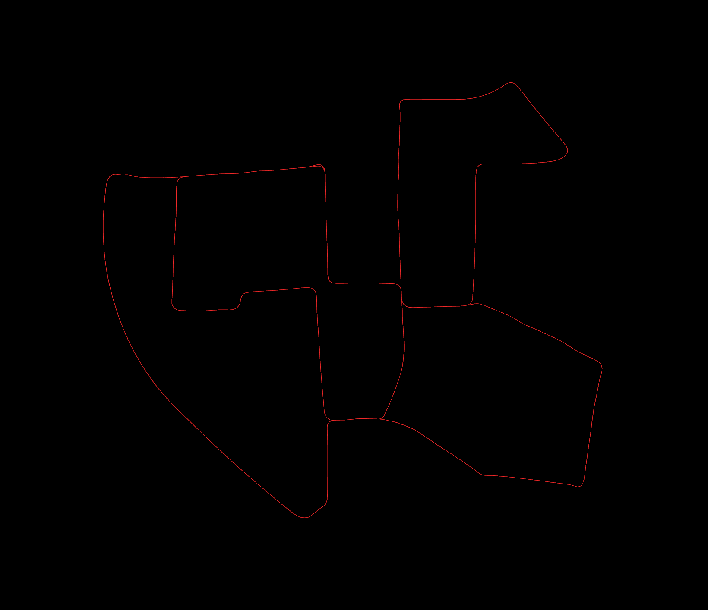

# Loopclosure for A-LOAM

This is a basic implementation of loopclosure detection for A-LOAM, which can be optimized（under developing）.

## 1. Dependency
- GTSAM
- ROS
- PCL

## 2. Results

- Before performing loop closure

- After performing loop closure

## 3. Acknowledgements
Thanks for [A-LOAM](https://github.com/HKUST-Aerial-Robotics/A-LOAM) and LOAM(J. Zhang and S. Singh. LOAM: Lidar Odometry and Mapping in Real-time) and LOAM_NOTED.
